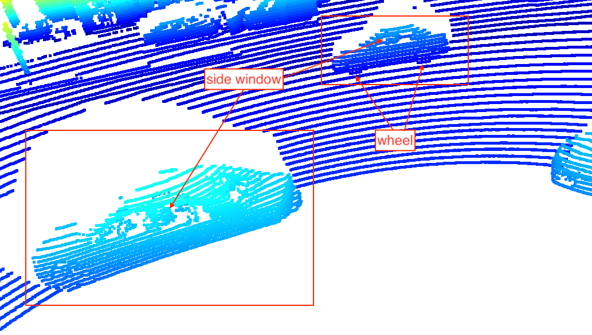
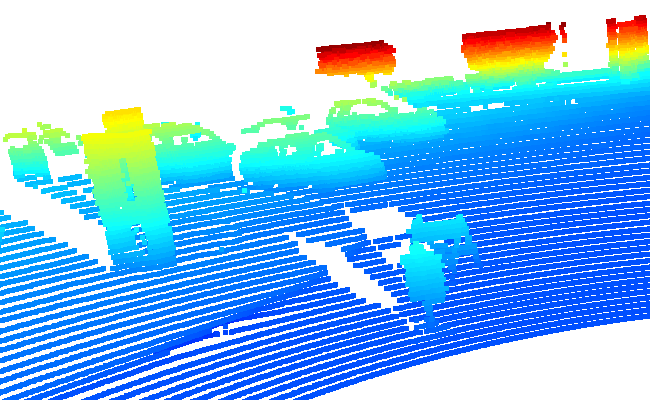
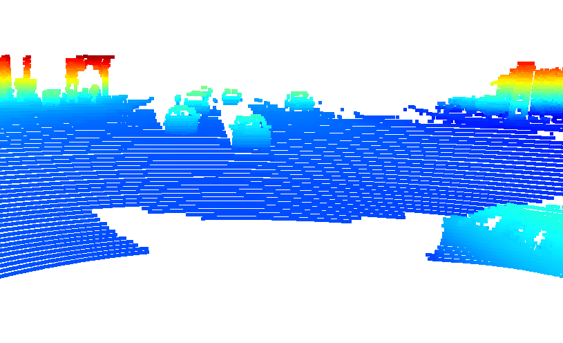
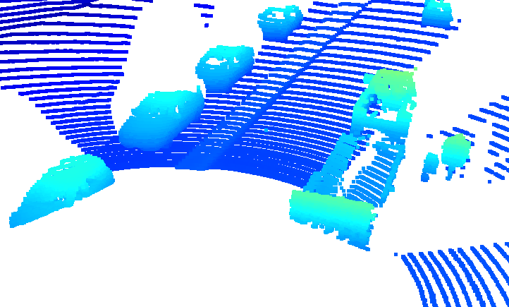
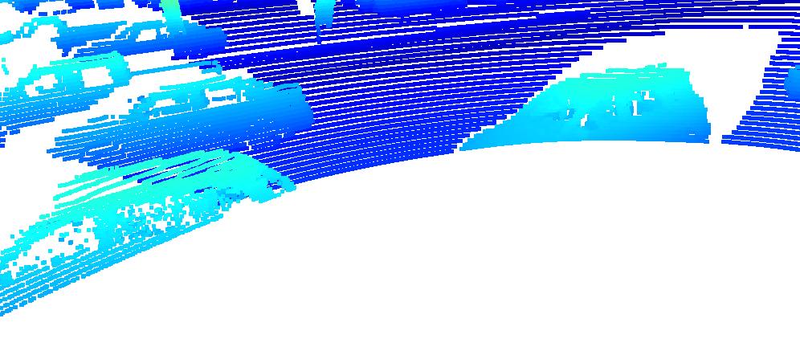
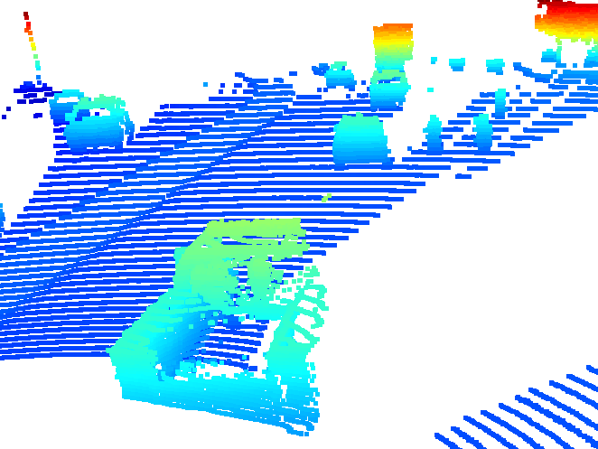
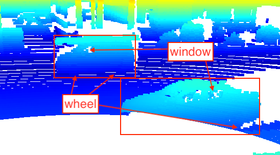
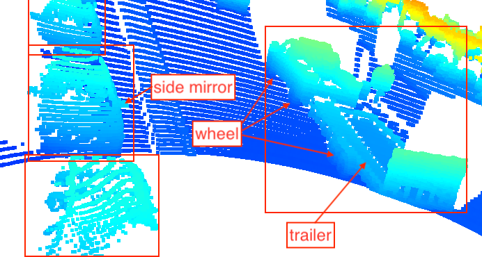
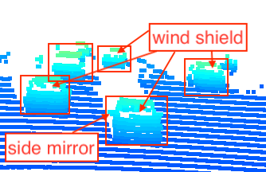

## Visualize point-cloud (ID_S1_EX2)

### Examples of vehicles with varying degrees of visibility in the point-cloud
#### (1) Side window, wheel

#### (2) Wind shield

#### (3) Wind shield, wheel

#### (4) Wind shield, trailer

#### (5) Side window, wheel

#### (6) Wheel

#### (7) Window, wheel

#### (8) Side mirror, wheel, bumper

#### (9) Side mirror, wheel, trailer

#### (10) Wind shield

I could identify the **wheels**, **bumpers**, **windows** and **side mirrors** of vehicles from the above images.
They might be used as a feature for detecting objects.
