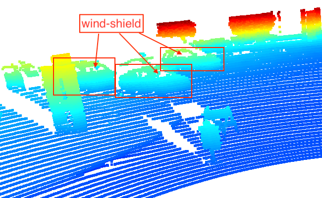
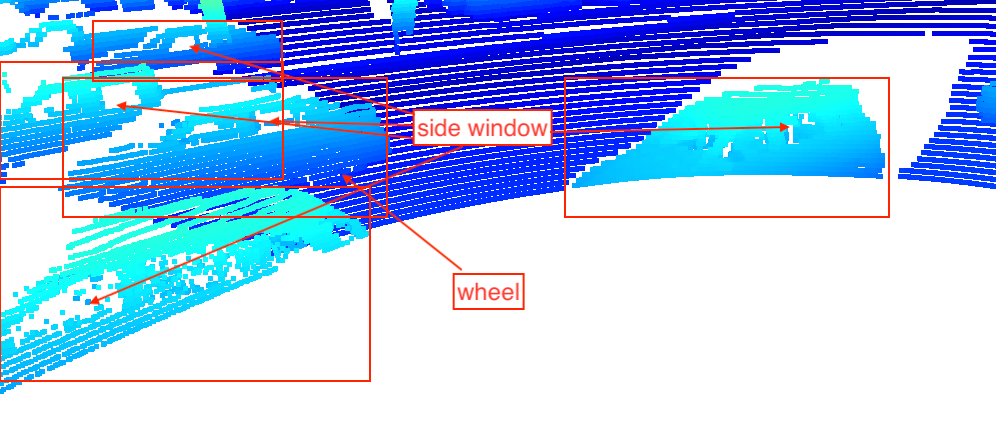

## Project overview
This project uses various sensor fusion algorithms.

### Set up
I used my local machine for this project. Here's the brief description how I set up an environment for the project.

#### How to set up the docker.
I used python:3.7 in this repo and installed pre-requisite modules using "pip -r requirements.txt".

### Visualize point-cloud (ID_S1_EX2)

#### 10 examples of vehicles with varying degrees of visibility in the point-cloud
##### (1)

##### (2)

##### (3)

##### (4)

##### (5)

##### (6)

##### (7)

##### (8)

##### (9)

##### (10)

I can commonly identify the **wheels**, **trunk**, **glasses** and **general car-like shapes** from the above images.
They might be used as a feature for detecting objects.
