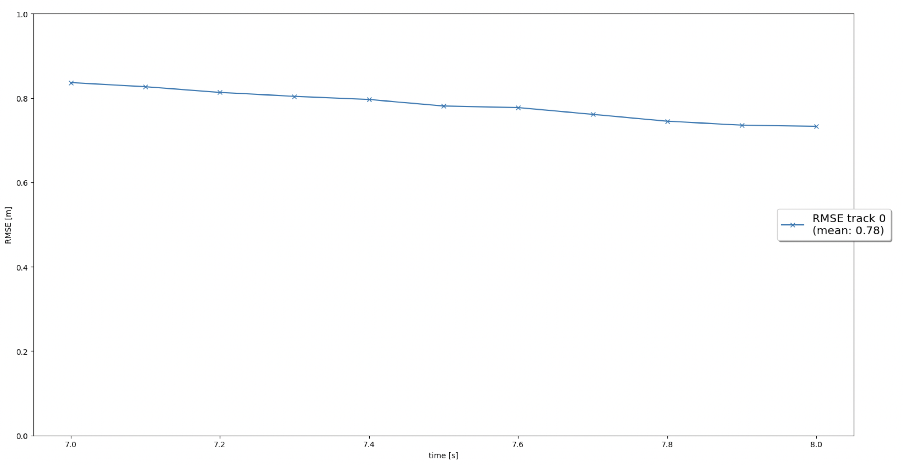

# Writeup: Track 3D-Objects Over Time

Please use this starter template to answer the following questions:

### 1. Write a short recap of the four tracking steps and what you implemented there (filter, track management, association, camera fusion). Which results did you achieve? Which part of the project was most difficult for you to complete, and why?

#### 1. Filter

I implemented an EKF to track a single real-world target with lidar measurement input over time.

- Implemented the predict() function for an EKF. 
- Implemented the F() and Q() functions to calculate a system matrix for constant velocity process model in 3D and the corresponding process noise covariance depending on the current timestep dt.
- Implemented the update() function as well as the gamma() and S() functions for residual and residual covariance. 

##### RMSE plot

#### 2. Track management

I implemented the track management to initialize and delete tracks, set a track state and a track score.

- Replaced the fixed track initialization values by initialization of track.x and track.P based on the input meas, which is an unassigned lidar measurement object of type Measurement. 
- Implemented the manage_tracks() function.
- Implemented the handle_updated_track() function.

##### RMSE plot

#### 3. Association

I implemented a single nearest neighbor data association to associate measurements to tracks

- Implemented the associate() function
- Implement the get_closest_track_and_meas() function

##### RMSE plot

#### 4. Camera fusion

I implemented the nonlinear camera measurement model.

- Implemented the function in_fov() that checks if the input state vector x of an object can be seen by this sensor.
- Implemented the function get_hx() with the nonlinear camera measurement function h
- Removed the restriction to lidar in the function generate_measurement() in order to include camera as well.
- Initialize camera measurement objects including z, R, and the sensor object sensor.

##### RMSE plot

##### Output video
[results/my_tracking_results.avi](results/my_tracking_results.avi)

### 2. Do you see any benefits in camera-lidar fusion compared to lidar-only tracking (in theory and in your concrete results)? 

Camera and Lidar has its own advantages and disadvantages. So that we can improve the accuracy of tracking by combining them.
In my results, RMSE was improved with camera fusion in step 4.

### 3. Which challenges will a sensor fusion system face in real-life scenarios? Did you see any of these challenges in the project?

There are more objects to be identified such as lane boundaries, pedestrians etc to achieve the safe driving. 

### 4. Can you think of ways to improve your tracking results in the future?

I can fine-tune my parameterization or change the association method to improve the results.
